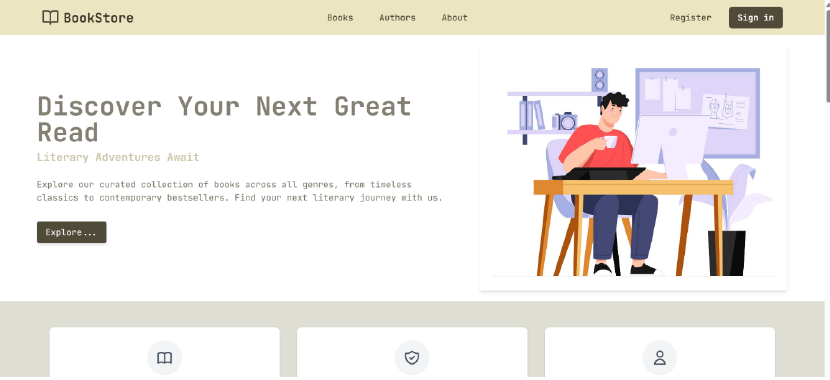

# 📚 Online Book Store

This project demonstrates an online book management system. It can be used by small bookshops to manage and sell books, as well as by simple libraries. With the addition of more features, the system can be scaled to support larger operations and services.

---



## 📘 About

The Online Book Store project demonstrates a full-stack web application where users can browse and purchase books(Not implemented Ye). It includes:

- User registration and login
- Role-based access control (Admin, Author, User)
- JWT-based authentication
- Book catalog management (added cart also)

This project serves as a practical example for developers interested in building secure, role-based web applications.

---

## ⚙️ Features

- **User Authentication**: Secure login and registration with JWT.
- **Role Management**: Differentiated access for Admin and User roles.
- **Book Catalog**: Browse and search available books and add to cart feature.
- **Admin Dashboard**: Manage users, books.

---

## 🛠️ Technologies Used

- **Frontend**: React, Tailwind CSS
- **Backend**: Java with Spring Boot
- **Database**: PostgreSQL
- **Authentication**: JWT (JSON Web Tokens)
- **Version Control**: Git

---

## 🚀 Installation

### Prerequisites

- Java 17 or higher
- PostgreSQL Database
- Node.js and npm (for frontend development)

---

## 🪛 Setup the project and Configure

1. Clone the repository

```bash
git clone https://github.com/KavishkaSasindu/Online_Book_Store.git
```
2. Then go to Frontend folder

```bash
//open a terminal
cd Frontend
```
3. install dependencies

```bash
// in that same folder location above i mentioned
npm install
// after run the frontend
npm run dev
```

4. Open backend folder via editor like Intellij Idea
5. Or you can manually install backend dependencies

```bash
//open a terminal
cd Backend
mvn install: run
```

## 🔚 Then you can configure the database property 

```bash
spring.datasource.url= your database url
spring.datasource.username= your databsase username (postgres)
spring.datasource.password= your database password
```

then run done with all setup and configuration.
